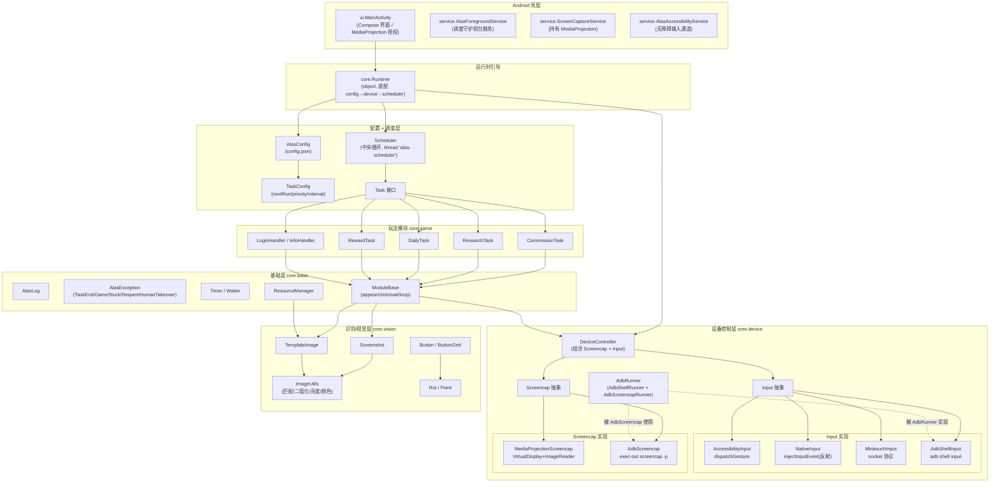

# ALAS-Android 架构设计

> 本文档基于仓库内实际 Kotlin 源码编写，所有类名、包名、方法签名均取自真实代码，未虚构 API。

ALAS-Android 是碧蓝航线（Azur Lane / 碧蓝航线）自动化脚本 **ALAS**（AzurLaneAutoScript，Python + OpenCV + ADB）的 Android 版。它参照 **MAA**（MaaAssistantArknights，明日方舟小助手）的 Android 端技术方案，把 ALAS 的"中央调度器 + 设备控制 + OpenCV 模板识别 + 玩法模块"架构整体迁移到 Android 平台，并针对移动端引入"设备端自控"能力，使自动化可以在手机上脱离电脑运行。

- 顶层包名：`com.alas.android`
- 游戏目标分辨率 / 识别坐标系：**1280×720**（对齐 ALAS）
- 入口：`AlasApplication` → `ui.MainActivity`
- 运行时装配：`core.Runtime`

---

## 1. 设计目标与 MAA→ALAS 的映射

### 1.1 设计目标

1. **免电脑运行（设备端自控）**：像 MAA 的 Android 原生控制单元（MaaAndroidNativeControlUnit）一样，用 `MediaProjection` 在手机本地截屏、用原生 `InputManager.injectInputEvent` 或无障碍 `dispatchGesture` 注入触控，实现"一部手机自己跑脚本"。
2. **兼容 ADB / 无线调试**：保留 ALAS 的经典外控方式——`adb screencap` 截图 + `adb shell input` / `minitouch` 触控注入，支持 USB 或 `adb tcpip`/`adb pair` 无线连接。
3. **复用 ALAS 的调度与识别语义**：配置驱动的任务调度（`next_run` + 优先级 + 启用状态 + 失败计数 → 人工接管）与 OpenCV 模板匹配识别（`TM_CCOEFF_NORMED`，阈值 0.85，二进制/亮度变体），让熟悉 ALAS 的用户能无缝迁移玩法逻辑。

### 1.2 MAA Android 方案如何落到本项目

| MAA Android 概念 | 本项目的对应实现 | 说明 |
| --- | --- | --- |
| MaaTouch app / MAA GUI | `ui.MainActivity`、`service.AlasForegroundService` | Android 壳层：界面、启动/停止、前台守护服务 |
| 原生控制单元 `MaaAndroidNativeControlUnit`（MediaProjection 截图 + 触控注入） | `MediaProjectionScreencap` + `NativeInput` / `AccessibilityInput` | 设备端自控两条输入路径 |
| `ControllerAPI`（screencap + input 抽象） | `DeviceController`、`Screencap`、`Input` | 统一的高层设备动作抽象 |
| `MaaTouch` 的 `Controller.java`（反射注入 `injectInputEvent`） | `NativeInput`（含 `PointersState` 多点触控状态机） | 直接对设备输入管理器注入 MotionEvent/KeyEvent |
| 无障碍手势注入 | `AccessibilityInput`（`dispatchGesture`） | 低权限、免 root 的自控备选输入 |
| Vision / Pipeline 节点识别 | `core.vision`（`TemplateImage`/`Button`/`Roi`/`ImageUtils`）+ 调度器 | 识别 + 调度（见下文映射） |
| ADB 控制 / ADB screencap | `AdbRunner`、`AdbScreencap`、`AdbShellInput`、`MinitouchInput` | 外控模式 |

### 1.3 对 ALAS 的对应

| ALAS（Python）概念 | 本项目对应实现 |
| --- | --- |
| 根 `alas.py` 的 `AzurLaneAutoScript` 中央调度 | `core.scheduler.Scheduler` |
| `module/config/config.py` | `core.config.AlasConfig`、`core.config.TaskConfig` |
| `module/base/template.py` | `core.vision.TemplateImage` |
| `module/base/button.py` | `core.vision.Button` / `ButtonGrid` |
| `module/base/utils.py` | `core.vision.ImageUtils` |
| `module/base/base.py`（ModuleBase） | `core.base.ModuleBase` |
| `module/device/device.py` | `core.device.DeviceController` |
| `module/device/control.py` | `core.device.Input` 及四种实现 |
| `module/device/screenshot.py` | `core.device.Screencap` 及两种实现 |
| `module/logger.py`、`module/exception.py`、`module/base/timer.py` | `core.base.AlasLog`、`AlasException`、`Timer` |
| `module/commission`、`module/research`、`module/daily`、`module/reward`、`module/handler` | `core.game.commission/…`、`LoginHandler` 等 |

---

## 2. 分层架构

源代码按如下层级组织（对应 `app/src/main/java/com/alas/android/` 下的目录）：

```
(a) Android 壳层     ui/            MainActivity（Compose 界面、MediaProjection 授权）
                     service/       AlasForegroundService / ScreenCaptureService / AlasAccessibilityService
(b) 运行时引导        core/Runtime.kt   装配 config → device → scheduler
(c) 设备控制层        core/device/      DeviceController + Input/Screencap + AdbRunner
                     core/device/input/     AdbShellInput / MinitouchInput / NativeInput / AccessibilityInput
                     core/device/screencap/ AdbScreencap / MediaProjectionScreencap
(d) 识别/视觉层       core/vision/      ImageUtils / TemplateImage / Button / Screenshot / Roi
(e) 基础层            core/base/        AlasLog / AlasException / Timer / ModuleBase / ResourceManager
(f) 配置 + 调度层     core/config/      AlasConfig / TaskConfig
                     core/scheduler/   Scheduler / Task
(g) 玩法模块          core/game/        handler / commission / research / daily / reward
```

### 2.1 各层职责

- **(a) Android 壳层**：`MainActivity` 提供设备连接设置与"启动/停止自动化"按钮；`AlasForegroundService` 以前台服务保活调度线程；`ScreenCaptureService` 持有 MediaProjection 授权结果供截图使用；`AlasAccessibilityService` 作为自控模式的无障碍输入通道。`AlasApplication` 在进程启动时初始化 `ResourceManager` 与 OpenCV。
- **(b) 运行时引导 `Runtime`**：单例装配器，读取 `AlasConfig`，按 `deviceMode` 选择设备控制方式，构造 `Scheduler` 与各玩法 `Task` 并启动。相当于 ALAS 的根 `alas.py`。
- **(c) 设备控制层**：`DeviceController` 组合一个 `Screencap` 与一个 `Input`，向上暴露 `screenshot() / click / swipe / longClick / keyEvent / inputText / appearAndClick` 等高层动作；两种截图源、四种输入实现与 `AdbRunner` 负责底层连接。
- **(d) 识别/视觉层**：把一帧 `Screenshot`（OpenCV `Mat`）与加载的 `TemplateImage` 做模板匹配，得到 `MatchResult`，结合 `Roi`、`Button` 完成"在屏幕上找按钮并点击"。
- **(e) 基础层**：日志、异常体系、定时器/等待器、玩法模块基类、全局模板资源管理。
- **(f) 配置 + 调度层**：`AlasConfig` 读写 `files/config.json`，`TaskConfig` 描述单个任务的调度元数据；`Scheduler` 在独立线程运行中央循环。
- **(g) 玩法模块**：每个玩法实现 `Task.run()`（并继承 `ModuleBase` 复用界面原语），由调度器调用。

### 2.2 架构总览（Mermaid）



---

## 3. 三种连接模式

`Runtime.buildDevice(...)` 根据 `AlasConfig.deviceMode` 分支：为 `"self_control"` 时走**设备端自控**，其余（默认 `"adb"`）走 **ADB 控制 / 无线调试**。三种模式最终都构造一个 `DeviceController`，上层玩法代码不感知差异。

```kotlin
// core/Runtime.kt（buildDevice）
return when (config.deviceMode) {
    "self_control" -> buildSelfControl(projectionHolder, accessibilityService)
    else           -> buildAdb(config)
}
```

### 3.1 设备端自控（SELF_CONTROL）

> MediaProjection 截图 + Native / Accessibility 输入。

- 截图源：`MediaProjectionScreencap(applicationContext(), projection, 1280, 720)`，通过 `MediaProjectionManager.createScreenCaptureIntent()` 授权后获得 `MediaProjection`，创建 `VirtualDisplay + ImageReader` 在本地截帧。
- 输入：优先 `AccessibilityInput(accessibilityService)`（无障碍手势注入，免 root）；无无障碍服务时回退 `NativeInput()`（反射 `InputManager.injectInputEvent`，需要系统签名/root）。

```kotlin
// core/Runtime.kt（buildSelfControl）
val screencap = MediaProjectionScreencap(applicationContext(), projection, 1280, 720)
val input = when {
    accessibilityService != null -> AccessibilityInput(accessibilityService)
    else                          -> NativeInput()
}
return DeviceController.selfControl(screencap, input, 1280, 720)
```

`DeviceController.selfControl(...)` 工厂只允许传入 `MediaProjectionScreencap`，与自控模式强绑定。授权流程在 `MainActivity`：

1. `startAutomation()` 检测 `deviceMode == "self_control"` → `requestProjection()`；
2. `requestProjection()` 调 `MediaProjectionManager.createScreenCaptureIntent()` 发起系统授权（`REQ_PROJECTION = 100`）；
3. `onActivityResult` 拿到 `resultCode` 与 `data` → `startProjectionService()`：
   - 用 `ScreenCaptureService.buildIntent(this, resultCode, data)` 启动并绑定 `ScreenCaptureService`；
   - `Runtime.start(this, projectionHolder = connectedProjectionService)` 传入投影持有者。

`MainActivity` 通过 `ScreenCaptureService.getProjection()` 取出授权后的 `MediaProjection` 交给运行时。

### 3.2 ADB 控制（USB / 外控）

> ADB `screencap` 截图 + `adb shell input` / `minitouch` 输入。

```kotlin
// core/Runtime.kt（buildAdb，摘要）
val adb   = AdbRunner(serial = if (address.isEmpty()) null else address)
val screencap = AdbScreencap(adb, 1280, 720)
val inputKind = when (config.inputMethod) {
    "minitouch" -> DeviceController.InputKind.MINITOUCH
    else        -> DeviceController.InputKind.ADB_SHELL
}
return DeviceController.adb(adb, screencap, inputKind, minitouchHost, 1111, 1280, 720)
```

- `AdbRunner` 实现 `AdbShellRunner`（`shell`）与 `AdbScreencapRunner`（`execOut`），同时供输入与截图使用；`serial` 取自 `config.adbAddress`（形如 `ip:port`），为空表示系统中唯一设备。
- `AdbScreencap.capture()` 执行 `adb exec-out screencap -p`，取回 PNG 后经 `orientAndScale` 处理旋转/缩放，统一校正到 1280×720。
- 输入由 `inputMethod` 决定：`minitouch` → `MinitouchInput`（本地 socket，握手 `v <ver> <max-contact> <max-x> <max-y>`，坐标按 maxX/maxY 缩放）；否则 → `AdbShellInput`（`input tap/swipe/keyevent/text`）。

### 3.3 无线调试

> 通过 `adb tcpip` / `adb pair` 与设备建立网络连接后，走与 ADB 控制相同的设备路径。

代码侧不区分"有线 ADB"与"无线 ADB"：两者都进入 `buildAdb(config)`。无线调试的差别在于连接方式——`AdbRunner` 提供 `connect(address)`（`adb connect <ip>:<port>`）与 `disconnect(address)`，用于把本机/模拟器通过 TCP 接入 adb server。之后 `AdbRunner` 以 `serial = config.adbAddress`（无线地址，如 `192.168.1.10:5555`）执行 shell 与 screencap。Android 11+ 的"无线调试"还需先用 `adb pair <ip>:<port>` 配对；`buildAdb` 中 `minitouchHost` 取 `config.adbAddress.substringBefore(":")`（如 `127.0.0.1` / 设备局域网 IP），作为 minitouch 守护进程的 host。

> 注：`Runtime` 中 ADB 分支只映射 `minitouch` 与 `adb_shell` 两种输入；`InputKind.NATIVE`/`ACCESSIBILITY` 枚举存在，但仅在设备端自控模式下使用。

---

## 4. 图像识别原理

识别层对齐 ALAS `module/base/template.py` 与 `module/base/utils.py`，核心是 **OpenCV 模板匹配**。

### 4.1 数据流

1. **截图**：`DeviceController.screenshot()`（带 100ms 节流）从 `Screencap.capture()` 取回一帧，包装为 `Screenshot`（内部持有 `Mat`，用完 `release()` 释放）。
2. **模板加载**：`TemplateImage` 从 `assets/templates/<server>/<category>/XXX.png` 或用户扩展目录 `files/templates/` 加载，构造时**预计算**三份数据：
   - 原始图像（用于标准 CCOEFF 匹配）；
   - `imageBinary`：`ImageUtils.otsuBinarize` 的 Otsu 二值图（用于 `matchBinary`）；
   - `imageLuma`：`ImageUtils.rgb2Luma` 的亮度图（用于 `matchLuma`）。
3. **匹配**：`TemplateImage.matchResult(imageSrc, similarity, roi)` 调用 `ImageUtils.matchTemplate`，在 `roi` 区域内执行 `Imgproc.matchTemplate(cropped, template, result, Imgproc.TM_CCOEFF_NORMED)`，再 `Core.minMaxLoc` 取最大相关系数与命中点。

### 4.2 关键参数（对齐 ALAS）

| 项 | 取值 | 说明 |
| --- | --- | --- |
| 匹配方法 | `TM_CCOEFF_NORMED` | 归一化相关系数模板匹配，`maxVal ∈ [-1, 1]`，代码中 `< 0` 视为未命中 |
| 默认相似度阈值 | `0.85` | 见 `TemplateImage.match / matchResult / matchBinary / matchLuma` 与 `ModuleBase.appear` |
| 识别坐标系 | **1280×720** | 与 ALAS 一致；`AdbScreencap.orientAndScale` 负责旋转/缩放校正 |
| 颜色相似阈值 | `10` | `Color.similar(other, threshold = 10)`，对齐 ALAS `color_similar` |

### 4.3 三种匹配变体

- `match` / `matchResult`：标准 RGB 模板匹配。
- `matchBinary`：先把目标图 Otsu 二值化，再用模板的 `imageBinary` 匹配，适用于模板本身与背景色彩差异明显的场景。
- `matchLuma`：把目标图转亮度，用模板的 `imageLuma` 匹配，对颜色敏感、亮度稳定的场景更稳。

### 4.4 ROI 与按钮

- `Roi`：识别区域（ALAS 的 `area`）。匹配只在 `roi` 内进行，既加速又避免误匹配；`Roi.full()` 表示全屏，`clampTo` 安全裁剪，`offset` 用于命中后换算坐标。
- `Button`：`area`（识别区）+ `buttonArea`（点击区，默认等于 area）+ 可选 `color`（纯色校验）。`randomPoint()` 在点击区内取随机点，模拟人手；`fromMatch(matchPoint, templateSize)` 由模板命中点构造按钮。
- `ButtonGrid`：由起点、步长、行列数批量生成一组按钮（九宫格/列表界面）。
- `DeviceController.appearAndClick(roi, template)` 是"识别并点击"的高层封装：截帧 → 匹配 → `Button.fromMatch` → `click(randomPoint())`。

### 4.5 玩法层使用识别

`ModuleBase`（`core.base`）对玩法模块暴露 `appear`、`appearThenClick`、`waitUntilAppear/Disappear`、`ensureClick`、`loop` 等原语；`template(assetPath)` 经 `TemplateLoader` → `ResourceManager` 惰性加载并缓存模板。玩法模块（`CommissionTask` 等）据此写命令式状态机。

---

## 5. 任务调度

调度层对齐 ALAS 根 `alas.py` 的中央调度器：`Scheduler` 在独立线程（`alas-scheduler`）运行主循环，从 `AlasConfig` 取到期任务，执行后写回 `nextRun`，失败计数达到阈值则请求人工接管。

### 5.1 调度配置

`AlasConfig` 持久化到 `files/config.json`；每个任务是一份 `TaskConfig`：

```kotlin
data class TaskConfig(
    val name: String,            // 任务名，如 "Commission"
    val enabled: Boolean,        // 是否启用
    val command: String,         // 对应玩法 Task 的 command 键，如 "commission"
    val successInterval: Long,   // 成功后到下次运行的间隔(秒)
    val failureInterval: Long,   // 失败后到下次运行的间隔(秒)
    val priority: Int,           // 优先级，越小越优先(对齐 ALAS SCHEDULER_PRIORITY)
    var nextRun: Long,           // 下次运行时间戳(epoch 秒)
    val serverUpdate: Boolean,   // 服务器更新后是否立即运行
)
```

默认任务（`AlasConfig.defaultTasks()`）：

| 任务 | command | enabled | success/failure 间隔(s) | priority |
| --- | --- | --- | --- | --- |
| Restart | restart | ✗ | 0 / 60 | 0 |
| Reward | reward | ✓ | 600 / 120 | 10 |
| Daily | daily | ✓ | 3600 / 600 | 20 |
| Commission | commission | ✓ | 900 / 300 | 30 |
| Research | research | ✓ | 1800 / 300 | 40 |

### 5.2 取下一个任务

`AlasConfig.getNextTask(now)`：过滤 `enabled && nextRun <= now` 的到期任务，按 `priority` 升序排序，返回第一个。

```kotlin
fun getNextTask(now: Long = System.currentTimeMillis() / 1000): TaskConfig? {
    val due = tasks.values.filter { it.enabled && it.nextRun <= now }.sortedBy { it.priority }
    return due.firstOrNull()
}
```

### 5.3 Scheduler 主循环

`Scheduler.start()` 启动 `Thread({ mainLoop() }, "alas-scheduler")`；`mainLoop` 结构：

```
loop:
    task = config.getNextTask(now)     // 到期 && 启用 && 按优先级
    if task == null:
        sleepUntilNextTask()           // 按最早 nextRun 休眠(上限 IDLE_WAIT_S=10s)
        continue
    runOne(task)                        // 执行对应 Task.run()
    catch RequestHumanTakeover: statusListener("需要人工接管"); stop()
    catch Throwable: log; sleep 1s
```

`runOne(taskConfig)`：
- 从 `taskRegistry` 按 `command` 取出玩法 `Task`；找不到 → `onFailure()` 并 `save()`。
- `task.run()` 成功 → `taskConfig.onSuccess()`，重置该命令失败计数；
- 失败（`GameStuckError` / `AlasException`）→ `recordFailure()`：累加失败计数、`taskConfig.onFailure()`；
- `finally` 统一 `config.save()` 写回 `nextRun`。

### 5.4 无缝续跑与人工接管

- **无缝续跑**：`TaskConfig.onSuccess()` / `onFailure()` 分别把 `nextRun` 推迟到 `now + successInterval` / `now + failureInterval`，即"跑完自动排下一次"，实现 ALAS 的无缝续跑。
- **失败计数 → 人工接管**：`recordFailure` 中 `n >= MAX_CONSECUTIVE_FAILURES(3)` 时抛出 `RequestHumanTakeover("连续失败 $n 次: ...")`，`mainLoop` 捕获后通过 `statusListener` 通知 UI"需要人工接管"并停止调度。
- `currentTask` 暴露当前运行任务名供 UI 观察；`stop()` 置 `stopped` 标志，循环随之退出。

### 5.5 玩法 Task

每个玩法类实现 `Task` 接口（`val name`、`fun run()`），并继承 `ModuleBase`。`Runtime.start` 把三者注册进调度器：

```kotlin
val tasks: Map<String, Task> = mapOf(
    "commission" to CommissionTask(dev, config.server),
    "research"   to ResearchTask(dev, config.server),
    "daily"      to DailyTask(dev, config.server),
)
scheduler = Scheduler(config, dev, tasks).also { it.start() }
```

> 注：`Runtime.start` 的 `tasks` 映射默认注册 `commission`/`research`/`daily`/`reward` 四个玩法，对应 `config.json` 中同名的 `command`。若在配置中启用了其他 `command`，需在 `Runtime` 的 `tasks` 映射中补注册对应 `Task`，否则调度器会报"no task implementation"并按失败处理。
